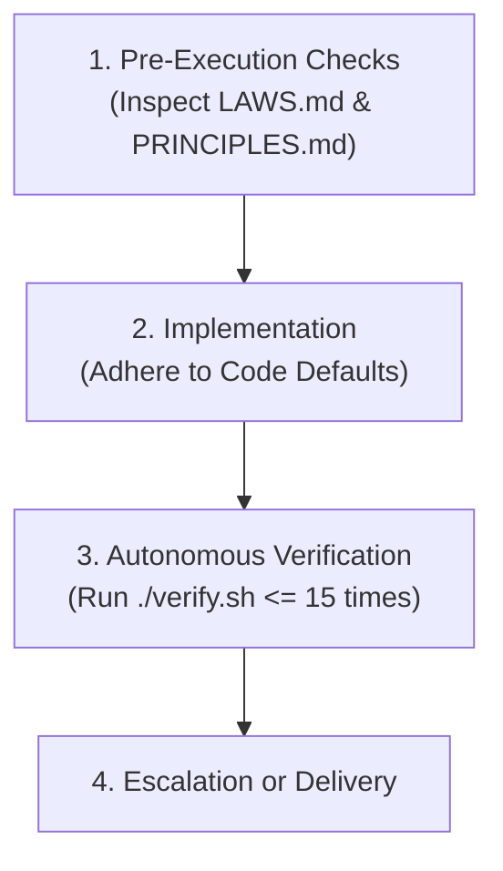

# Agent Operating Instructions & Execution Governance

This file defines the primary governing protocol for all AI assistants and autonomous coding agents operating within the `mini-search-engine` workspace.

All agents must strictly obey the governance structure bound by [`LAWS.md`](file:///Users/zyndrex/mini-search-engine-sandbox/LAWS.md), [`PRINCIPLES.md`](file:///Users/zyndrex/mini-search-engine-sandbox/PRINCIPLES.md), and [`HARNESS.md`](file:///Users/zyndrex/mini-search-engine-sandbox/HARNESS.md).

---

## Agent Execution Loop

Whenever assigned a task, every agent must proceed through four distinct phases:

### Phase 1: Pre-Execution Alignment
1. **Read Laws and Principles**: Check [`LAWS.md`](file:///Users/zyndrex/mini-search-engine-sandbox/LAWS.md) and [`PRINCIPLES.md`](file:///Users/zyndrex/mini-search-engine-sandbox/PRINCIPLES.md) before writing code.
2. **Escalation Pre-Check**: If the task requires adding external dependencies, changing public API routes/contracts, or altering binary/DB schemas, **stop and obtain user confirmation first**.
3. **Immutability Check**: Verify that neither [`LAWS.md`](file:///Users/zyndrex/mini-search-engine-sandbox/LAWS.md) nor any test file in `tests/laws/` will be modified.

### Phase 2: Implementation & Code Standards
1. **Adhere to Code Defaults**:
   - Provide explicit typed domain errors (`Result<T, EngineError>`); avoid silent `None` fallbacks.
   - Avoid premature abstractions for single-use logic; keep code concrete and idiomatic.
   - Zero untyped bypasses; justify every `unsafe` operation with a `// SAFETY:` invariant explanation.
2. **Preserve System Invariants**:
   - Maintain binary format headers (`MSEDOC01`, `MSEIDX01`) and byte offsets.
   - Ensure strictly increasing monotonic document IDs and word positions in posting lists.
   - Guarantee non-negative, finite BM25 scores and valid WAND upper bounds.

### Phase 3: Autonomous Verification Loop
1. Execute [`./verify.sh`](file:///Users/zyndrex/mini-search-engine-sandbox/verify.sh) after making changes.
2. If [`./verify.sh`](file:///Users/zyndrex/mini-search-engine-sandbox/verify.sh) fails:
   - Carefully inspect compiler diagnostics, clippy warnings, or test tracebacks.
   - Make targeted corrective adjustments in the implementation files.
   - Repeat the execution of [`./verify.sh`](file:///Users/zyndrex/mini-search-engine-sandbox/verify.sh).
   - **Autonomously iterate up to 15 times** to resolve any errors before stopping.

### Phase 4: Escalation or Delivery
- If all stages of [`./verify.sh`](file:///Users/zyndrex/mini-search-engine-sandbox/verify.sh) pass cleanly: deliver results with clickable file and symbol references.
- If errors persist after 15 autonomous attempts: escalate to the user with full error logs and diagnostic details.
