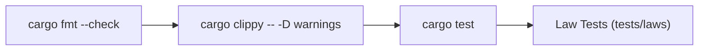

# Verification Harness & Quality Pipeline

This document defines the toolchain, verification steps, and autonomous repair protocol for the `mini-search-engine` repository.

---

## Toolchain Specification

The repository consists of three Rust crates targeting Rust 1.85+ (Edition 2024):
- **Crates**:
  - `crawler` ([`crawler/Cargo.toml`](file:///Users/zyndrex/mini-search-engine-sandbox/crawler/Cargo.toml))
  - `indexer` ([`indexer/Cargo.toml`](file:///Users/zyndrex/mini-search-engine-sandbox/indexer/Cargo.toml))
  - `search_api` ([`search_api/Cargo.toml`](file:///Users/zyndrex/mini-search-engine-sandbox/search_api/Cargo.toml))
- **Build System**: Cargo (`cargo`)
- **Code Formatter**: `rustfmt` (`cargo fmt`)
- **Static Analysis & Linter**: `clippy` (`cargo clippy`)
- **Test Runner**: Cargo Test (`cargo test`)

---

## Exact Verification Pipeline

All changes must pass the full verification pipeline implemented in [`verify.sh`](file:///Users/zyndrex/mini-search-engine-sandbox/verify.sh):



### Stage 1: Code Formatting
Checks source code formatting against repository style rules without altering files:
```bash
cargo fmt --manifest-path crawler/Cargo.toml --check
cargo fmt --manifest-path indexer/Cargo.toml --check
cargo fmt --manifest-path search_api/Cargo.toml --check
```

### Stage 2: Static Analysis & Lints
Ensures zero compiler warnings, dead code, or unidiomatic patterns:
```bash
cargo clippy --manifest-path crawler/Cargo.toml -- -D warnings
cargo clippy --manifest-path indexer/Cargo.toml -- -D warnings
cargo clippy --manifest-path search_api/Cargo.toml -- -D warnings
```

### Stage 3: Automated Unit & Integration Tests
Executes all unit tests and integration test suites:
```bash
cargo test --manifest-path crawler/Cargo.toml
cargo test --manifest-path indexer/Cargo.toml
cargo test --manifest-path search_api/Cargo.toml
```

### Stage 4: Law Verification Suite
Verifies non-negotiable invariants defined in [`LAWS.md`](file:///Users/zyndrex/mini-search-engine-sandbox/LAWS.md) whenever law tests are present under `tests/laws/`.

---

## Autonomous Fix Mandate

> [!IMPORTANT]
> **15-Iteration Autonomous Resolution Rule**:
> Autonomous agents are **mandated to run `./verify.sh` up to 15 times** in an autonomous iterative loop to fix compiler errors, lint issues, formatting discrepancies, and test failures.
> - Agents must diagnose the failure, modify the implementation, and re-run `./verify.sh`.
> - Only after **15 consecutive failed attempts** may the agent halt and escalate to the user.
> - When escalating, the agent must present the exact error logs, the hypotheses tested, and why human intervention is required.
